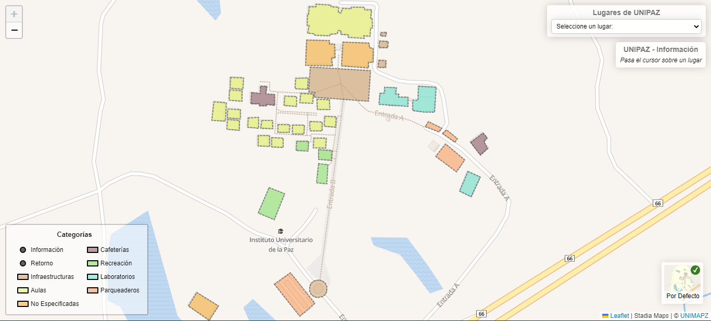

<div align="center">

  # UNIMAPZ
  Mapa del Instituto Universitario de la Paz - Unipaz 🕊

  

</div>

## 🚨 Requerimientos

- Tener Node Instalado (Versión de **npm** mayor o igual a 7.9.0)

```bash
npm -v
```

## ☄ Instalación

1. Clona este repositorio
2. Instala sus Dependencias

```
npm i --legacy-peer-deps
```

1. Crea un archivo llamado `.env.local` en la carpeta `map` colocando en el archivo los 2 **TOKEN** o puede guiarse del archivo `.env.example` (No recomendable ya que son tokens publicos):

```js
VITE_MAPBOXTOKEN = "" // puede obtener el token en https://www.mapbox.com/
VITE_STADIATOKEN = "" // puede obtener el token en https://stadiamaps.com/
```

## ⚡ Ejecución

> **Mapa**: El código fuente completo del mapa se encuentra en la carpeta `map`

> **Página Principal**: El código de la página con información relevante del mapa se encuentra en `page`

- Ejecuta el mapa de forma local
```bash
npm run dev
```

- Ejecuta la página de forma local
```bash
npm run dev:page
```

- Genera el código de producción del mapa
```bash
npm run build
```

- Genera el código de producción de la página
```bash
npm run build:page
```

## 👩‍💻 Contribuidores

> - [Natalia Rodriguez](https://github.com/XNataX)
> - [Luis Osorio](https://github.com/LuisFOsG)
> - [Jhan Lopez](https://github.com/xJhanx)
> - [Breinner Rueda](https://github.com/DasCode-Brm)
> - [Bryan Muñoz](https://github.com/BryanSMC)
> - [Aldair Caballero](https://github.com/ItzAlda1)
> - [Javier Rodriguez](https://github.com/xavi-1521)

## 📃 Licencia

Actualmente usamos una [LICENCIA](./LICENSE) MIT.
